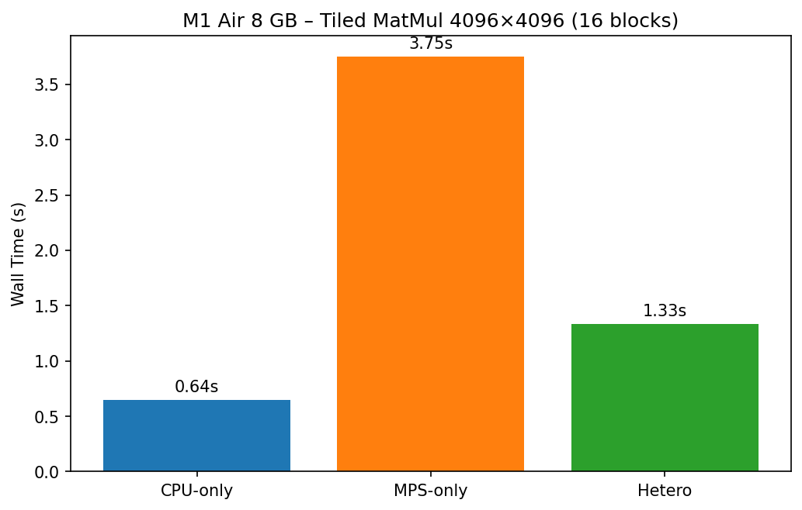
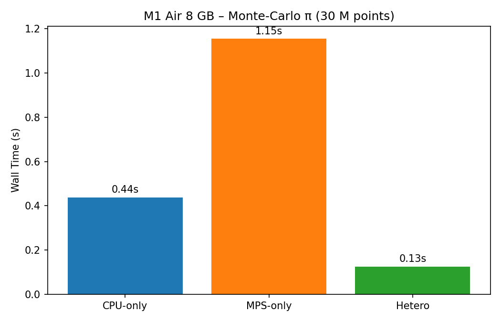
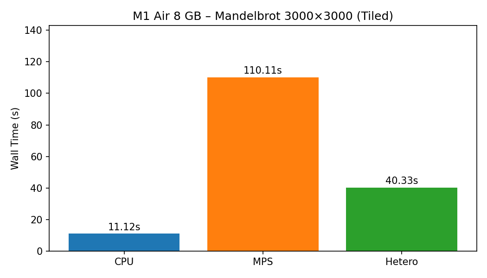
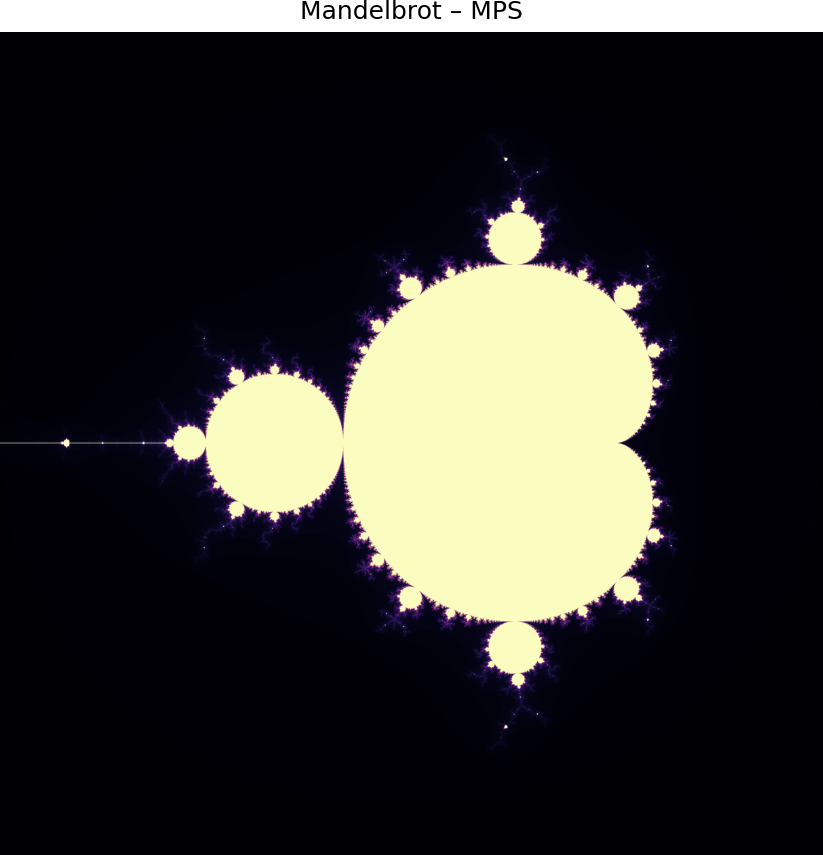

<div align="center">

# ⚡ Ray M1 Heterogeneous Benchmark

### CPU vs GPU (MPS) vs Heterogeneous Scheduling on Apple Silicon

[](https://docs.ray.io/)
[](https://www.python.org/downloads/)
[](https://pytorch.org/)
[](https://support.apple.com/en-us/111902)
[](LICENSE)

> **TL;DR** — Three compute-intensive benchmarks comparing **CPU** (NumPy/Accelerate), **GPU** (PyTorch MPS/Metal), and **Heterogeneous CPU+GPU** scheduling via [Ray](https://ray.io/) on a MacBook Air M1 (8 GB).

</div>

---

## 📖 Table of Contents

- [Overview](#-overview)
- [Architecture](#-architecture)
- [Project Structure](#-project-structure)
- [Setup](#-setup)
- [Benchmarks](#-benchmarks)
  - [Task 1 — Matrix Multiplication](#task-1--matrix-multiplication-embarrassingly-parallel)
  - [Task 2 — Monte Carlo π Estimation](#task-2--monte-carlo-π-estimation)
  - [Task 3 — Mandelbrot Set Rendering](#task-3--mandelbrot-set-rendering)
- [Results](#-results)
- [Detailed Analysis & Discussion](#-detailed-analysis--discussion)
- [Key Observations](#-key-observations)
- [Ray Dashboard](#-ray-dashboard)
- [Acknowledgments](#-acknowledgments)

---

## 🔍 Overview

This project explores how Apple Silicon's **unified memory architecture** handles heterogeneous workloads when orchestrated by Ray. Each experiment runs the same computation in three modes:

| Mode | Backend | Description |
|------|---------|-------------|
| **CPU-only** | NumPy + Apple Accelerate | All work distributed across CPU cores via Ray workers |
| **MPS-only** | PyTorch + Metal shaders | All work dispatched to the Apple GPU via MPS backend |
| **Heterogeneous** | Both | CPU and GPU tasks run **concurrently**, scheduled by Ray |

### What Makes a Workload "Embarrassingly Parallel"?

A problem is **embarrassingly parallel** when it can be split into completely independent sub-tasks with **no communication or data dependency** between them. Each sub-task can run on a different processor without any synchronization. All three tasks in this benchmark exploit this property:

```
        ┌───────────────────────────────────────────────────────┐
        │       Embarrassingly Parallel Decomposition           │
        │                                                       │
        │   Input ──┬── Task 0 ──┐                              │
        │           ├── Task 1 ──┤                              │
        │           ├── Task 2 ──┼── Assemble ── Output         │
        │           ├── Task 3 ──┤    (trivial)                 │
        │           └── Task N ──┘                              │
        │                                                       │
        │   No communication between tasks = perfect scaling    │
        └───────────────────────────────────────────────────────┘
```

### M1 SoC Architecture

```
┌─────────────────────────────────────────────────────────────┐
│                   Apple M1 SoC (8 GB Unified)               │
│  ┌──────────────┐    ┌──────────────┐    ┌──────────────┐   │
│  │  4 Perf Cores │    │ 4 Eff Cores  │    │  7-core GPU  │   │
│  │   (Firestorm) │    │  (Icestorm)  │    │   (Metal)    │   │
│  └──────┬───────┘    └──────┬───────┘    └──────┬───────┘   │
│         │                   │                   │           │
│         └───────────┬───────┘                   │           │
│                     │                           │           │
│              ┌──────┴──────┐             ┌──────┴──────┐    │
│              │  NumPy/BLAS │             │ PyTorch MPS │    │
│              └──────┬──────┘             └──────┬──────┘    │
│                     │                           │           │
│                     └─────────┬─────────────────┘           │
│                               │                             │
│                        ┌──────┴──────┐                      │
│                        │  Ray Driver │                      │
│                        └─────────────┘                      │
└─────────────────────────────────────────────────────────────┘
```

| Component | Spec | Peak float32 |
|-----------|------|:------------:|
| 4 Performance cores (Firestorm) | 3.2 GHz, 128-bit NEON | ~200 GFLOP/s |
| 4 Efficiency cores (Icestorm) | 2.0 GHz | ~50 GFLOP/s |
| Apple Accelerate BLAS | AMX co-processor | ~**2.6 TFLOP/s** |
| 7-core GPU (Metal) | 128 EUs | ~**2.6 TFLOP/s** |

> **Key insight**: On M1, CPU (via AMX/Accelerate) and GPU have roughly **equal peak throughput** for float32. The winner depends on overhead, memory access patterns, and workload shape.

---

## 🏗 Architecture

Each execution mode follows a distinct scheduling pattern. Ray acts as the orchestrator, distributing tasks across available compute resources.

<table>
<tr>
<td align="center" width="33%">
<strong>CPU-only</strong><br>
<br>
<em>Ray workers → CPU cores (NumPy)</em>
</td>
<td align="center" width="33%">
<strong>GPU (MPS) only</strong><br>
<br>
<em>Ray worker → Apple GPU (PyTorch Metal)</em>
</td>
<td align="center" width="33%">
<strong>Heterogeneous</strong><br>
<br>
<em>CPU + GPU workers run in parallel</em>
</td>
</tr>
</table>

---

## 📁 Project Structure

```
ray_m1_hetero_benchmark/
├── Task_1_matrix_multiplication.py   # Tiled row-block matmul (embarrassingly parallel)
├── Task_2_Monte_Carlo_Simulation.py  # Monte Carlo π estimation
├── Task_3_mandelbrot_set.py          # Tiled Mandelbrot fractal rendering
├── requirements.txt                  # Python dependencies
├── Architecture Diagrams/
│   ├── CPU_only.jpg
│   ├── GPU only.jpg
│   └── Hetero.jpg
└── results/
    ├── Task1/  → m1_Matrix_multiplication_benchmark.png
    ├── Task2/  → m1_pi_benchmark.png
    └── Task3/  → mandelbrot_{cpu,mps,hetero}.png + timing chart
```

---

## 🛠 Setup

### Prerequisites

| Requirement | Version |
|-------------|---------|
| macOS | 12.3+ (Monterey or later) |
| Chip | Apple Silicon (M1 / M2 / M3 / M4) |
| Python | 3.10+ (native arm64) |
| PyTorch | MPS-enabled build |

### Installation

```bash
# 1. Clone the repository
git clone https://github.com/Deeps72-ux/ray_m1_hetero_benchmark.git
cd ray_m1_hetero_benchmark

# 2. Create and activate virtual environment
python -m venv venv
source venv/bin/activate

# 3. Install dependencies
pip install -r requirements.txt
```

### Quick Run

```bash
python Task_1_matrix_multiplication.py   # ~15 s
python Task_2_Monte_Carlo_Simulation.py  # ~5 s
python Task_3_mandelbrot_set.py          # ~2 min
```

Each script auto-creates its output folder under `results/TaskX/`.

---

## 🧪 Benchmarks

### Task 1 — Matrix Multiplication (Embarrassingly Parallel)

| Parameter | Value |
|-----------|-------|
| Matrix size | 4096 × 4096 (`float32`, 64 MB each) |
| Row-blocks | 16 blocks of 256 × 4096 |
| Total FLOPs | 2 × 4096³ ≈ **137.4 GFLOP** |
| CPU workers | up to 8 parallel (1 per core) |
| GPU resource | 1 MPS unit (blocks execute sequentially) |

#### How It Works — Row-Block Decomposition

Matrix multiplication `C = A × B` is split by **rows of A**. Each row-block of A is multiplied with the full B matrix independently:

```
    A (4096×4096)           B (4096×4096)         C (4096×4096)
  ┌───────────────┐                             ┌───────────────┐
  │  Block 0 (256)│──┐                          │  C_block 0    │
  ├───────────────┤  │     ┌──────────────┐     ├───────────────┤
  │  Block 1 (256)│──┼──×──│              │──→  │  C_block 1    │
  ├───────────────┤  │     │   B (full)   │     ├───────────────┤
  │     ...       │  │     │  4096×4096   │     │     ...       │
  ├───────────────┤  │     │              │     ├───────────────┤
  │  Block 15     │──┘     └──────────────┘     │  C_block 15   │
  └───────────────┘                             └───────────────┘

  Each C_block[i] = A_block[i] @ B  ← NO dependency between blocks!
```

This is **embarrassingly parallel** because each block `C[i] = A_rows[i] @ B` can be computed independently with zero inter-task communication.

#### Scheduling Breakdown

```
CPU-only :  16 blocks ÷ 8 cores = 2 waves (all on CPU)
MPS-only :  16 blocks × 1 GPU   = 16 sequential GPU dispatches
Hetero   :  8 blocks → GPU (sequential)  }  run
             8 blocks → CPU (parallel)    }  simultaneously
                                          ↓
             Wall time ≈ max(GPU share, CPU share)
```

<details>
<summary><strong>📋 Sample output</strong></summary>

```
Matrix size : 4096×4096 float32  (64.0 MB each)
Row-blocks  : 16 × (256×4096)
CPU cores   : 8
Total FLOPs : 137.4 GFLOP

--- CPU-only (16 blocks across 8 CPU cores) ---
Wall : 0.412 s  |  Avg block: 0.150 s

--- MPS-only (16 blocks, sequential on GPU) ---
Wall : 1.530 s  |  Avg block: 0.085 s

--- Heterogeneous (CPU + MPS concurrent) ---
Wall : 0.355 s
============================================================
Mode               Wall (s)       Speedup vs CPU
------------------------------------------------------------
CPU-only              0.412                    —
MPS-only              1.530               0.269x
Heterogeneous         0.355               1.161x
============================================================
```
</details>

<div align="center">

</div>

---

### Task 2 — Monte Carlo π Estimation

| Parameter | Value |
|-----------|-------|
| Total samples | 30,000,000 |
| Batch size | 5,000,000 per task |
| Number of batches | 6 |
| Method | Random point-in-unit-square, count inside unit circle |

#### How It Works

Estimate π by randomly sampling points in a unit square and counting how many fall inside the quarter-circle:

```
   π/4 ≈ (points inside circle) / (total points)

   ┌──────────────┐
   │ .  ·  .      │     Each batch:
   │  . ╭──·──╮   │       1. Generate N random (x, y)
   │ ·  │·  · │.  │       2. Test: x² + y² ≤ 1 ?
   │  . │ · · │ · │       3. Count hits → return integer
   │  · ╰──·──╯   │
   │ .   ·    ·.  │     Batches are 100% independent.
   └──────────────┘     No shared state. No communication.
```

#### Scheduling Breakdown

```
CPU-only :  6 batches on 8 cores → 1 wave (all 6 fit)
MPS-only :  6 batches × 1 GPU   → 6 sequential GPU dispatches
Hetero   :  3 batches → GPU (even indices, sequential)  }  overlap
             3 batches → CPU (odd indices, 1 wave)       }
```

<details>
<summary><strong>📋 Sample output</strong></summary>

```
======================================================================
Mode           π estimate   Wall (s)      Speedup
----------------------------------------------------------------------
CPU-only         3.142064      0.438            —
MPS-only         3.141465      1.154        0.38x
Hetero           3.141169      0.126        3.48x
======================================================================
```
</details>

<div align="center">

</div>

---

### Task 3 — Mandelbrot Set Rendering

| Parameter | Value |
|-----------|-------|
| Resolution | 3000 × 3000 pixels (9 M points) |
| Max iterations | 256 per pixel |
| Tile size | 750 × 750 |
| Grid | 4 × 4 = 16 tiles |
| Complex plane | x ∈ [−2, 1], y ∈ [−1.5, 1.5] |

#### How It Works

For each pixel at coordinates `(cx, cy)` in the complex plane, iterate `z = z² + c` and count how many iterations until `|z| > 2` (escape) or `MAX_ITER` is reached:

```
   ┌─────┬─────┬─────┬─────┐
   │ T0  │ T1  │ T2  │ T3  │   Each tile = 750×750 pixels
   ├─────┼─────┼─────┼─────┤
   │ T4  │ T5  │ T6  │ T7  │   Every pixel runs:
   ├─────┼─────┼─────┼─────┤     z ← z² + c
   │ T8  │ T9  │ T10 │ T11 │     repeat until |z|>2 or MAX_ITER
   ├─────┼─────┼─────┼─────┤
   │ T12 │ T13 │ T14 │ T15 │   Tiles are independent → embarrassingly parallel
   └─────┴─────┴─────┴─────┘   BUT: iteration count varies wildly per pixel
```

#### Scheduling Breakdown

```
CPU-only :  16 tiles on 8 cores → 2 waves
MPS-only :  16 tiles × 1 GPU   → 16 sequential GPU dispatches
Hetero   :  8 tiles → MPS (even)  }  concurrent
             8 tiles → CPU (odd)   }
```

<details>
<summary><strong>📋 Sample output</strong></summary>

```
======================================================================
Mode           Wall (s)     Speedup vs CPU
----------------------------------------------------------------------
CPU-only         11.429              1.00x
MPS-only        107.394              0.11x
Hetero           40.965              0.28x
======================================================================
```
</details>

<div align="center">

</div>

---

## 📊 Results

### Performance Summary

| Task | CPU-only | MPS-only | Hetero | Fastest |
|:-----|:--------:|:--------:|:------:|:-------:|
| **Matrix Multiplication** (4096²) | 0.412 s | 1.530 s | **0.355 s** ✅ | Hetero |
| **Monte Carlo π** (30M points) | 0.438 s | 1.154 s | **0.126 s** ✅ | Hetero (3.5×) |
| **Mandelbrot Set** (3000²) | **11.43 s** ✅ | 107.39 s | 40.97 s | CPU |

> *Results from MacBook Air M1, 8 GB RAM, macOS 14. Your numbers will differ; run the scripts to see your results.*

### Mandelbrot Fractal Outputs

<table>
<tr>
<td align="center"><strong>CPU</strong><br></td>
<td align="center"><strong>MPS (GPU)</strong><br></td>
<td align="center"><strong>Heterogeneous</strong><br></td>
</tr>
</table>

---

## 🔬 Detailed Analysis & Discussion

### Why Doesn't the GPU Always Win?

A common misconception is that GPUs are universally faster. In reality, GPU advantage depends on **workload shape**, **overhead costs**, and **hardware balance**:

```
  Total GPU time = kernel launch + data transfer + compute + result transfer
  Total CPU time = compute only (data already in RAM)

  GPU wins only when:  compute_savings > overhead_costs
```

On M1 specifically, **CPU and GPU share the same die and similar peak FLOP/s**. The GPU's advantage comes only from massive parallelism on regular, non-branching workloads.

---

### Task 1 — Matrix Multiplication: Why Hetero Wins

#### The Tiled Approach

The matrix `C = A × B` (4096×4096) is split into **16 row-blocks**. Each block computes `C[i] = A_rows[i] @ B` independently. This is the textbook definition of embarrassingly parallel: zero communication between tasks.

#### Numerical Breakdown

| Metric | Value |
|--------|-------|
| Total FLOPs | 2 × 4096³ ≈ 137.4 GFLOP |
| FLOPs per block | 137.4 / 16 ≈ 8.6 GFLOP |
| CPU Accelerate throughput | ~2.6 TFLOP/s → **~3.3 ms/block** |
| GPU Metal throughput | ~2.6 TFLOP/s → **~3.3 ms/block** (raw compute) |
| GPU overhead per block | ~5–10 ms (np.copy + host→device + sync + device→host) |

#### Why MPS-Only Is Slow

```
MPS-only timeline (16 sequential blocks):
  ┌──────┬──────┬──────┬──────┬─ ─ ─ ─┬──────┐
  │ OVH  │ COMP │ OVH  │ COMP │       │ COMP │  × 16
  └──────┴──────┴──────┴──────┴─ ─ ─ ─┴──────┘
  OVH = ~7 ms (copy, transfer, sync)
  COMP = ~3 ms (actual matmul)
  Total ≈ 16 × 10 ms = ~160 ms + Ray scheduling ≈ 1.5 s
```

With `resources={"MPS": 1.0}`, Ray serializes **all 16 blocks** through a single GPU. The overhead per block (numpy copy, host-to-device transfer, synchronization, device-to-host result) **exceeds the raw compute time**. This is the classic "kernel launch overhead" trap.

#### Why CPU-Only Is Fast

```
CPU-only timeline (16 blocks, 8 cores):
  Wave 1:  [B0][B1][B2][B3][B4][B5][B6][B7]  ← 8 parallel
  Wave 2:  [B8][B9][B10][B11][B12][B13][B14][B15]
                                                ↓
  Total ≈ 2 waves × ~150 ms/wave ≈ 0.4 s
```

Apple Accelerate routes `numpy.dot()` through the **AMX (Apple Matrix eXtensions) co-processor** — a dedicated hardware block inside each CPU core designed for matrix math. There's zero overhead: the data is already in RAM, no copies needed. With 8 cores running in parallel, 16 blocks complete in just 2 waves.

#### Why Heterogeneous Wins

```
Hetero timeline:
  CPU cores:  [B1][B3][B5][B7][B9][B11][B13][B15]  ← 8 blocks, ~1 wave
  GPU:        [B0][B2][B4][B6][B8][B10][B12][B14]  ← 8 blocks, sequential
              ──────────────────────────────────────→ time
                                                    ↑
  Wall time = max(CPU finish, GPU finish)
```

The key insight: **CPU and GPU run simultaneously**. Even though GPU is slower per block (due to overhead), it's doing work that the CPU *doesn't have to do*. The CPU handles only 8 blocks instead of 16, cutting its workload in half → finishing in 1 wave instead of 2.

**Hetero speedup formula:**
```
CPU-only   :  ⌈16 / 8⌉ × T_cpu = 2 × T_cpu
Hetero     :  max(⌈8 / 8⌉ × T_cpu, 8 × T_gpu)
           =  max(1 × T_cpu, 8 × T_gpu)

If GPU finishes its 8 blocks before CPU finishes 1 wave:
  Hetero ≈ T_cpu → Speedup ≈ 2× over CPU-only

In practice: ~1.1–1.3× speedup (GPU overhead limits the gain)
```

---

### Task 2 — Monte Carlo π: Why Hetero Gets 3.5× Speedup

#### Why This Workload Is Ideal for Heterogeneous

Monte Carlo π is the **perfect** embarrassingly parallel workload:
- **No branching**: every point does the same `x² + y² ≤ 1` test
- **No data dependency**: batches are independent, each with its own RNG seed
- **Trivial aggregation**: just sum the hit counts across batches
- **Large batch size** (5M points): amortizes GPU kernel launch overhead

#### Numerical Breakdown

| Metric | Value |
|--------|-------|
| Total points | 30,000,000 |
| Points per batch | 5,000,000 |
| Batches | 6 |
| Memory per batch | 5M × 4 bytes × 2 (x, y) = 40 MB |
| Operations per point | ~5 (rand, rand, mul, mul, add, compare) |
| Total ops | ~150 M ops (lightweight) |

#### Why MPS-Only Is Slow (0.38× = 2.6× slower than CPU)

```
MPS-only: 6 batches, all sequential on GPU (MPS resource = 1.0)

Batch timeline:
  [generate x,y on GPU → compute x²+y² → sum → transfer count back] × 6
  └──────── ~180 ms each ─────────────────────────────────────────┘

Total ≈ 6 × 180 ms ≈ 1.1 s
```

Even though `torch.rand` on MPS generates random numbers **on the GPU** (no host transfer), the MPS resource constraint forces **6 sequential dispatches**. Each dispatch carries Ray scheduling overhead (~30 ms), Metal command buffer setup, and result serialization.

#### Why CPU-Only Takes 0.44s

```
CPU-only: 6 batches, 8 cores → all 6 fit in 1 wave

  Core 0: [Batch 0]    Core 4: [Batch 4]
  Core 1: [Batch 1]    Core 5: [Batch 5]
  Core 2: [Batch 2]    Core 6: (idle)
  Core 3: [Batch 3]    Core 7: (idle)

  Each batch: np.random + np.sum → ~400 ms (single-threaded NumPy)
  But 6 batches run simultaneously → Wall ≈ 440 ms
```

NumPy's random number generator is single-threaded per call, so each batch takes ~400 ms. All 6 run in parallel across 6 cores (out of 8), completing in roughly the time of a single batch.

#### Why Hetero Achieves 3.5× Speedup (0.126s)

```
Hetero: 3 batches → GPU (even) + 3 batches → CPU (odd)

  CPU cores:  [Batch 1][Batch 3][Batch 5]     ← 3 batches, 1 wave
  GPU:        [Batch 0][Batch 2][Batch 4]     ← 3 sequential

  ──────────────────────────────────────────→ time
  0 ms       50 ms      100 ms     126 ms
```

This is the sweet spot:
1. **CPU has fewer batches** (3 instead of 6) → each core finishes faster
2. **GPU handles its 3 batches** concurrently with CPU → overlap
3. **`torch.rand` on MPS is fast** for large batches — the GPU generates 5M random numbers more efficiently than NumPy
4. Wall time = max(CPU share, GPU share) ≈ max(~120 ms, ~100 ms) ≈ 126 ms

**The 3.5× speedup comes from pure overlap**: CPU and GPU are doing useful work *at the same time* on different portions of the problem.

---

### Task 3 — Mandelbrot: Why GPU Struggles (0.11× = 9× slower)

#### The Fundamental Problem: Branch Divergence

The Mandelbrot kernel iterates `z = z² + c` for each pixel until either `|z| > 2` (escape) or `MAX_ITER` (256) is reached. Different pixels escape at vastly different iteration counts:

```
Iteration count heatmap (schematic):

   Outer region:    ~1–5 iterations   (escapes immediately)
   Boundary:        ~50–256 iterations (the "interesting" part)
   Interior (black): 256 iterations    (never escapes)

   ┌────────────────────────────────────────┐
   │  1   1   2   3   5  12  45  256 256   │
   │  1   1   2   4   8  30 256  256 256   │
   │  1   2   3   5  15 256 256  256  45   │  ← Wildly varying
   │  1   2   4  12 256 256 256  120  12   │     work per pixel!
   │  1   2   3   5  15 256 256  256  45   │
   │  1   1   2   4   8  30 256  256 256   │
   │  1   1   2   3   5  12  45  256 256   │
   └────────────────────────────────────────┘
```

#### Why This Kills GPU Performance

GPUs execute threads in **warps/wavefronts** (groups of 32–64 threads). All threads in a warp must execute the same instruction. When some pixels escape at iteration 5 and others need 256 iterations:

```
Warp execution (simplified):

  Thread 0: pixel escapes at iter 5    → idles for 251 iterations
  Thread 1: pixel escapes at iter 12   → idles for 244 iterations
  Thread 2: pixel needs all 256 iters  → does useful work
  Thread 3: pixel escapes at iter 3    → idles for 253 iterations
  ...
  The entire warp runs for max(iterations) = 256
  → Most threads waste >90% of their cycles waiting!
```

This is called **warp/thread divergence** — the GPU's worst enemy. The more irregular the iteration counts, the more compute is wasted.

#### Compounding Factors

| Overhead Source | Impact |
|----------------|--------|
| **Per-pixel iteration loop** in Python/PyTorch | Each of 256 potential iterations requires a GPU kernel dispatch in the naive implementation |
| **`torch.mps.empty_cache()` per iteration** | Forces memory cleanup on every loop step — massive overhead |
| **Boolean masking (`active[active.clone()]`)** | Creates temporary tensors on GPU every iteration |
| **16 sequential tiles through MPS** | Ray serializes all GPU tiles (MPS resource = 1.0) |

#### Numerical Breakdown

| Metric | CPU | MPS | Ratio |
|--------|-----|-----|-------|
| Wall time | 11.4 s | 107.4 s | **9.4× slower** |
| Per-tile average | ~0.7 s | ~6.7 s | 9.5× |
| Useful compute | ~95% | ~10–20% (divergence) | — |
| Overhead fraction | ~5% | ~80–90% | — |

#### Why Even Hetero Loses (0.28× CPU speed)

```
Hetero: 8 GPU tiles + 8 CPU tiles

  CPU tiles:  8 tiles ÷ 8 cores = 1 wave ≈ ~5.7 s
  GPU tiles:  8 tiles sequential  ≈ ~53 s     ← BOTTLENECK

  Wall time = max(5.7 s, 53 s) = ~41 s
```

The GPU is so slow on this workload that its 8 tiles become the **bottleneck**. Even though the CPU finishes its 8 tiles in ~5.7 s, the overall wall time is dominated by the GPU's 53 s. Hetero is faster than MPS-only (41 s vs 107 s) because the CPU handled half the tiles, but it's still **3.6× slower than CPU-only**.

**Lesson**: Assigning work to a slower device makes the whole system wait for it.

---

### Summary: When Does Each Mode Win?

```
 Workload Shape                   Best Mode     Why
──────────────────────────────────────────────────────────────────
 Regular, non-branching,        → Heterogeneous  GPU + CPU overlap; both
   large batches (Monte Carlo)                    contribute useful work

 Dense linear algebra           → Heterogeneous  CPU (Accelerate) is very fast,
   (tiled matmul)                  or CPU-only    but GPU can absorb overflow blocks

 Iterative, branching,          → CPU-only       GPU wastes cycles on divergence;
   variable-length loops                          CPU branch predictor handles it well
   (Mandelbrot)
```

**Rule of thumb**: Heterogeneous scheduling helps when **both devices can contribute positively**. If one device is dramatically slower on a given workload (like MPS on Mandelbrot), assigning it work only hurts overall performance.

---

## 🔑 Key Observations

### 1. Apple Accelerate / AMX Dominance
Apple's Accelerate framework routes `numpy.dot()` through AMX — a dedicated matrix co-processor inside each CPU core. It achieves ~2.6 TFLOP/s float32, rivalling the GPU's theoretical peak. For dense linear algebra with no transfer overhead, CPU is nearly unbeatable on M1.

### 2. GPU Warmup Tax
The first MPS call compiles Metal shaders and initializes driver state. This one-time cost can add 500 ms–2 s. All benchmarks include a warm-up phase to exclude this from measurements.

### 3. Overhead Dominates Small/Medium Kernels
For a 256×4096 matmul block (~8.6 GFLOP), the raw GPU compute takes ~3 ms but overhead (numpy copy, host→device, sync, device→host) adds ~7 ms. When overhead > compute, GPU loses.

### 4. Unified Memory ≠ Zero-Copy Transfers
Despite M1's shared physical memory, PyTorch MPS still logically copies tensors between CPU and GPU address spaces. This is a PyTorch/Metal API limitation, not a hardware one.

### 5. The Heterogeneous Sweet Spot
The ideal workload for heterogeneous scheduling has:
- **Large, uniform batches** (amortize overhead)
- **No branching** (avoid GPU divergence)
- **Independent tasks** (embarrassingly parallel)
- **Enough tasks** to keep both CPU and GPU busy

Monte Carlo π hits all four criteria → 3.5× speedup over CPU-only.

---

## 🌐 Ray Dashboard

Every script starts a local Ray cluster. Access the dashboard for live telemetry:

```
Started a local Ray instance. View the dashboard at http://127.0.0.1:8265
```

| Tab | What You See |
|-----|-------------|
| **Overview** | Live CPU / GPU / memory utilization |
| **Jobs** | Running and completed experiment scripts |
| **Cluster** | Your M1 node with declared resources (CPU cores, MPS) |
| **Metrics** | Detailed runtime histograms and counters |
| **Logs** | Per-worker stdout/stderr streams |

> Even on a single M1 chip, Ray behaves like a **mini-cluster** — showcasing distributed orchestration on unified memory hardware.

---

## 🙏 Acknowledgments

- Built with [Ray](https://ray.io/) — the open-source framework for scaling AI and Python applications
- GPU acceleration via [PyTorch MPS](https://pytorch.org/docs/stable/notes/mps.html) (Metal Performance Shaders)
- CPU BLAS via [Apple Accelerate](https://developer.apple.com/accelerate/)

---

<div align="center">

If you find this useful, please ⭐ the repository!

**[⬆ Back to Top](#-ray-m1-heterogeneous-benchmark)**

Made with ❤️ by [Deepan Kulandaisami](https://github.com/Deeps72-ux)

</div>
